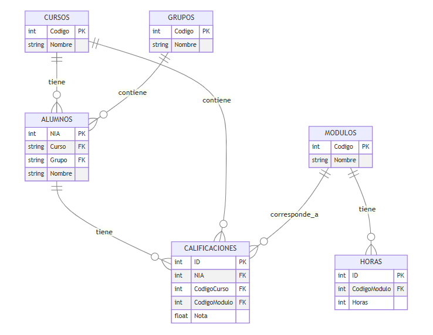
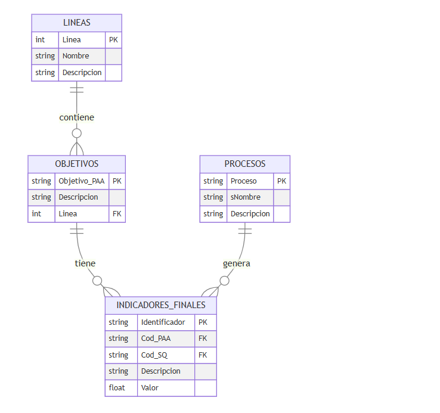

# Análisis Académico - Tarea 1: La Primera Inspección

**4.1 - ¿Cuál es el separador de columnas?**  

Para todos los archivos excepto el `Indicadores_Finales.csv` el separador es (`,`) para el archivo de `Indicadores_Finales.csv` el separador es (`;`)

**4.2 - ¿La primera fila contiene los nombres de las columnas (encabezados) y son claros y descriptivos?** 

En todos los archivos la primera linea contiene el nombre de las columnas.

La gran parte de los encabezados son claros pero hay algunos ficheros con algunas columnas que pueden ser mas confusas, estos son:

  En `Indicadores_Finales.csv` los campos **Valor-A**, **Valor-T1**, **Valor-T2**, **Valor-T3**, **Cod_SQ** y **Cod_PAA** son confusos y poco comprensibles. El resto de archivos parecen tener encabezados descriptivos y funcionales.

**4.3 - Inspecciona visualmente las primeras 20-30 filas. ¿Ves valores que te parezcan extraños o que faltan (celdas vacías, "N/A", "s/d")?**

  -En `Grupos.csv` los campos **ensenanza**, **linea**, **oficial** tienen el mismo valor en todos los registros por lo que parecen innecesarios.

  -En `Calificaciones.csv` hay multiples campos que no tienen casi ningun valor en  registro, como: **medidas_inf** y en **capacidades_inf** donde solo hay en ocasiones un valor: "No hay datos guardados".

  -En `Indicadores_Finales.csv` los campos de **Valor-T1**, **Valor-T2** y **Valor-T3** tienen la gran mayoria de los registros vacios.

  -Existen valores como **fecha_exportacion** parecen tener siempre el mismo valor pero podria ser simplemente porque no tenemos todos los registros por lo que no parece un problema.
  
**4.4 - ¿Los formatos son consistentes? Por ejemplo, ¿las fechas están siempre como DD/MM/AAAA o a veces cambian?**

  Los formatos parecen ser consistentes, las fechas utilizan el formato DD/MM/AAAA y las horas HH:MM:SS. No he encontrado ningún otro formato que parezca ser inconsistente.

**4.5 - Identifica las "claves" o "IDs" que podrían servir para relacionar unos ficheros con otros (ej: id_alumno en el fichero de calificaciones.csv y también en alumnos.csv ).**

  Vamos a dividir este punto en dos secciones, una para las relaciones entre los ficheros de **Datos Alumnos** y otra para los ficheros de **Indicadores**

**Datos Alumnos**

  - Un curso puede tener muchas calificacciones ya que en calificaciones hay un código (que es el del curso) 
  
  - Un modulo puede tener muchas calificaciones ya que en calificaciones hay un contenido (que es cp el del modulo) 
  
  - Un alumno puede puede tener muchas calificaciones ya que hay un campo NIA en calificaciones
  
  - Un modulo puede tener muchas horas ya que en horas hay un campo Código (Que aparece también en el modulo)
   
  - Un curso puede tener muchos alumnos ya que en alumno hay un campo curso que coincide con el código del curso 
  
  - Por ultimo un grupo puede tener muchos alumnos ya que en la tabla alumno hay un campo grupo que coincide con el código de grupo.

  Este seria el diagrama en relación con estas columnas.

  

**Indicadores**

- Una linea puede tener múltiples objetivos ya que el primer numero de la columna Objetivo_PAA coincide con la columna Linea del fichero lineas. 

- Un objetivo puede tener varios indicadores finales en forma de una clave que es Cod_PAA que es tiene la columna Objetivo_PAA del fichero Objetivos. 

- Luego un proceso puede tener multiples indicadores finales pues en la columna Cod_SQ de indicadores finales hay un codigo en forma de I + la columna proceso del archivo procesos + un número indicador del proceso.

Este seria el diagrama en relación con estas columnas.

  

